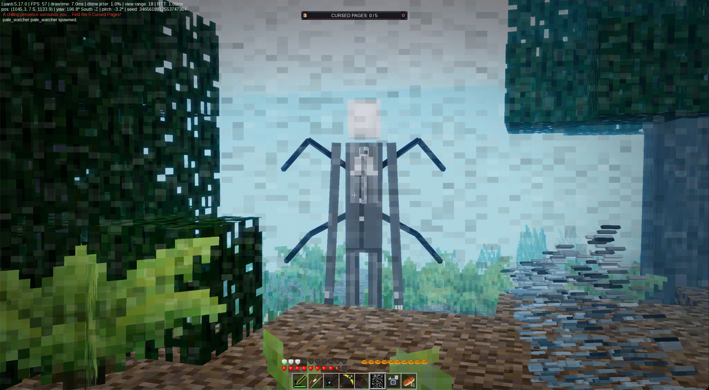

# The Pale Watcher

[](https://content.luanti.org/packages/SaKeL/pale_watcher/)
[](https://content.luanti.org/packages/SaKeL/pale_watcher/)
[](license.txt)
[](license.txt)

[](https://github.com/sakel-hub/pale_watcher/actions)


A psychological horror mob mod for Luanti powered by the `x_mob_core` framework.



The Pale Watcher is an eerie nightmare creature that stalks players through dark forests. Rather than chasing you like a standard monster, he uses **True Quantum Stalking**: freezing completely still whenever you look straight at him, and silently lunging forward through blind spots the instant you look away.

---

## Objective & Gameplay Overview

Venturing through deep, unlit forests at night can awaken the Pale Watcher. When he chooses you as his prey, the surrounding woods are sealed in a heavy black fog, and **Cursed Pages** appear scattered across nearby tree trunks and stone faces.

The number of cursed pages dynamically scales with the size of your hunting party:
- **Solo Explorer (1 Player)**: **5 Pages**
- **Duo (2 Players)**: **8 Pages**
- **Trio (3 Players)**: **11 Pages**
- **Squad (4+ Players)**: **14 Pages** (Capped at 14)

If new players enter the fog, additional pages manifest on tree trunks in real-time. If a player leaves, disconnects, or falls in battle, a 20-second grace period begins—if they do not return, the required pages scale down for the survivors while leaving any extra candidate pages in the forest (Mercy Rule)!

Your goal is simple yet terrifying:
1. **Search the Forest**: Navigate through the dark woods and collect all required **Cursed Pages**.
2. **Survive the Stalker**: Watch your sightlines, use your **Vintage Flash Camera** to stun him when cornered, and never let him catch you off guard.
3. **Ignite the Cleansing Flame**: Build and light a **Ritual Pyre** to channel the collected curses, banishing the Pale Watcher and claiming rare dimensional relics.

---

## Step-by-Step Guide: How to Play & Win

```
[Phase 1: The Dark Forest]
         │
         ▼
[The Stalker Awakens at Night] ──► Black Fog Rolls In & Cursed Pages Appear
         │
         ▼
[Phase 2: The Cursed Page Hunt]
         ├── Listen for eerie whispers and watch for black ink wisps (nearby)
         ├── Use the Static Core like a compass to point toward hidden pages
         └── Defend yourself with the Vintage Flash Camera when cornered
         │
         ▼
[All Pages Gathered] ──► Top Screen Plaque Glows Gold: "PAGES: X / X — IGNITE RITUAL PYRE!"
         │
         ▼
[Phase 3: The Pyre Banishment]
         ├── Craft and place a Ritual Pyre on the ground
         ├── Right-click the Pyre to ignite the Cleansing Flame
         └── The Pale Watcher is pulled into the fire and banished
         │
         ▼
[Phase 4: Dimensional Relics]
         └── Collect Dimensional Cloth & Static Cores to craft the Shroud of Stalking
```

### Phase 1: Encounter Initiation
- **Where He Lurks**: The Pale Watcher appears naturally in dense, dark woodlands (grassy soils, pine forests, beneath thick tree canopies) during the night in deep darkness.
- **The Forest Seals In**: When he locks onto you:
  - An oppressive black fog settles across the woods, limiting your view to your immediate surroundings.
  - Cursed Pages manifest on tree trunks and stone walls within 15 to 45 blocks of where you were standing, positioned at eye level so they are easy to reach.
  - A clean gothic plaque appears at the top of your screen, displaying `CURSED PAGES: 0 / [Total]`.

### Phase 2: Finding the Cursed Pages
- **Whispers and Ink**: When you get within 24 blocks of a page, faint whispers echo around you and dark ink wisps drift off the tree bark.
- **Instant Absorption**: Punch or right-click a page to pick it up. The curse is instantly absorbed into your ritual progress—pages never clutter your bag with unnecessary items.
- **The Static Core Scanner**: If you find or craft a **Static Core**, holding it and clicking (left or right) acts like a paranormal detector. If you point directly toward a hidden page within 20 blocks, the core crackles loudly with static and eerie whispers.
- **Ritual Ready**: Once your team finds the required number of pages, the counter at the top of your screen shifts from soft ivory to bright glowing gold: `★ PAGES: [Total] / [Total] — IGNITE RITUAL PYRE! ★`.

### Phase 3: Surviving the Stalker
While you search for pages, the Pale Watcher will be hunting you:
- **The Glancing Rule**: Looking straight at him freezes him in place. However, staring continuously drains your sanity, gives you tunnel vision, slows your movement, and slowly hurts you. Glance at him for a second or two to stop his advance, then look away to keep running.
- **Vintage Flash Camera**: If he corners you, bring up your **Vintage Flash Camera** and click (left or right). The blinding xenon flash stuns him for 3 to 5 seconds, making him cover his face and retreat into the misty tree line. The camera holds 3 flash charges and takes 10 seconds to recharge between shots.
- **Do Not Hide in Tiny Holes**: Digging down and sealing yourself inside a tight 1x1 or 1x2 bunker will not save you. Cramped hideouts trigger his **Anti-Bunker Curse**—he will phase straight through the wall and choke you with dark energy.
- **Weave Through Trees**: If you sprint in a straight line, he will anticipate your path and teleport ahead of you behind the trees. Weave around tree trunks to break his line of approach.

### Phase 4: The Pyre Banishment (Completing the Encounter)
Once all required pages are gathered:
1. Craft a **Ritual Pyre** (4 stone, 4 wood, and 1 torch).
2. Place the pyre on flat ground in the forest.
3. Right-click the pyre to ignite the **Cleansing Flame**. The gathered curses channel straight from your progress into the altar.
4. **The Banishment Climax**:
   - The Pale Watcher is dragged into the center of the pyre and trapped.
   - He levitates upward through roaring sacred flames.
   - With a burst of static shockwaves, the creature implodes into dark smoke, void mist, and glowing embers.
5. The fog clears, the forest returns to normal, and the nightmare is defeated!

### Phase 5: Crafting the Shroud of Stalking
Defeating the Pale Watcher rewards you with rare materials:
- **Dimensional Cloth**: Dark void fabric threaded with crimson.
- **Static Core**: A sphere humming with radio energy.
- **Pale Ash**: Remains left behind after the banishment.

Combine 4 pieces of Dimensional Cloth and 1 Static Core to craft the **Shroud of Stalking**. Wearing or holding this cloak lets you hold **Sneak** and **Click** to **Blink forward up to 14 blocks** through shadows!

---

## Alternative Ways to Escape

If you cannot find all pages, you can still survive through two escape methods (note: morning sunlight will not save you—the Pale Watcher stalks continuously across both day and night until banished or escaped):

- **Escape 1: Reach a Sanctuary**: Reach an area with bright artificial light (light level 14 or higher, such as a large bonfire, beacon, or illuminated outpost). The Pale Watcher cannot cross into bright sanctuary light; he will stare silently from the edge of the shadows and dissolve into the tree line.
- **Escape 2: Run for the Boundary**: Run 100 blocks away from where the encounter started. Near the 85-block mark, he will try one last ambush from behind a tree. Slip past him, cross the 100-block mark, and a deep horn will sound as the black fog clears and the encounter ends.

---

## Game Mechanics & Creature Behavior

### Quantum Stalking Rules
- **Direct Gaze Freeze**: When you look directly in his direction, the Pale Watcher freezes motionless with an imposing stare. He will not vanish when you turn around or approach—giving you the full, chilling jumpscare!
- **Close-Range Retaliation**: If you dare to approach him within melee striking reach (around 2.5 blocks), the Pale Watcher delivers a vicious punch that deals heavy damage and knocks you flying backward!
- **Unseen Movement**: The moment your back is turned or trees block your sight, he slips forward in complete silence, leaping closer through the shadows.
- **Immunity to Standard Weapons**: Hitting him with ordinary swords, bows, or tools will not kill him. Striking him triggers an eldritch shockwave that blasts you back, and causes him to slip into the trees behind you.

### Atmosphere & Screen Effects
- **Creeping Screen Shadows**: Dark vignettes close in around the borders of your display as danger approaches, heightening the tension.
- **Dense Black Fog**: Heavy fog limits your view, hiding tree trunks until you are close.
- **Heartbeat & Dynamic Static**: As he gets closer, a pounding heartbeat sounds in your ears, accompanied by eerie radio static. The static interference dynamically adapts to ambient light: gentle, legible film noise during dark nights so tree notes remain easy to find, and fierce, high-contrast glitch snow during the day cutting through bright sunlight.

### Light Source Interference
- **Flickering Torches**: Hand-placed torches and lanterns within arm's reach (about 5 blocks) flicker and drop to the floor when he can see them. He cannot put out lights through solid walls, and powerful sanctuary lights are immune.
- **Trembling Hands**: Holding a torch or lantern in your hand while staring directly into his face causes your character to drop the light source in terror.

### Page Counter Plaque & Dynamic Scaling
- A gothic plaque appears at the top of your screen to track your collected pages.
- Solo players need **5 pages**, while multiplayer groups scale dynamically (+3 pages per additional player up to 14).
- The counter shows in clean, high-contrast ivory while hunting, and switches to a glowing radiant gold active plaque once all required pages are found and the ritual pyre is ready.

---

## Items & Crafting Recipes

### Ritual Pyre (`pale_watcher:ritual_pyre`)
The altar used to ignite the Cleansing Flame and banish the creature.
```text
[ Stone ] [ Wood  ] [ Stone ]
[ Wood  ] [ Torch ] [ Wood  ]
[ Stone ] [ Wood  ] [ Stone ]
```

### Vintage Flash Camera (`pale_watcher:flash_camera`)
Defensive flash camera with 3 charges. Click (left or right) to release a blinding xenon flash. Blinds and stuns the Pale Watcher for 3 to 5 seconds up to 22 blocks away. Recharges every 10 seconds.
```text
[        ] [  Torch  ] [        ]
[ Steel  ] [  Glass  ] [ Steel  ]
[ Steel  ] [  Steel  ] [ Steel  ]
```

### Shroud of Stalking (`pale_watcher:shroud_of_stalking`)
End-game mobility gear. Hold **Sneak** and **Click** (left or right click) to instantly Blink forward up to 14 blocks through the shadows. Recharges every 4 seconds.
```text
[ Cloth ] [ Static Core ] [ Cloth ]
[ Cloth ] [             ] [ Cloth ]
```

### Static Core (`pale_watcher:static_core`)
A sphere of quantum radio noise. Click while holding it to scan for hidden Cursed Pages within 20 blocks in the direction you are facing (crackles with static when pointed at a page). Right-clicking chests, cursed pages, or doors while holding it interacts with them normally.

---

## In-Game Commands

| Command | Who Can Use | What It Does |
| :--- | :--- | :--- |
| `/pw_locate` | All players | Tells you how far away remaining uncollected pages are and which compass direction (North, South, East, West) to look for them. |
| `/pw_clear [<player>]` | All players (self) / Admins (others) | Emergency command that instantly removes any lingering horror screen overlays, static noise, slow movement, and black fog. |

---

## Mod Settings

Server owners can adjust these settings in `luanti.conf` or through the Settings menu:

```ini
# How far you must run from the starting point to escape the encounter (in blocks)
# Default: 100.0 (Range: 50.0 to 300.0)
pale_watcher_tether_radius = 100.0
```

---

## Disconnect Safety & World Cleanliness

- **Disconnect & Timeout Protection**: If you leave the game, disconnect, or time out during an encounter, all speed penalties, screen static, domain fog, and active item sounds are immediately stopped and cleared.
- **Player Death & Reconnect Reset**: Dying or rejoining the server cleanly clears any lingering visual overlays, camera capacitor cooldowns, and tool audio so you always respawn at a clean baseline.
- **Server Shutdown & Restart Safety**: When the server stops or restarts, all active encounters, background sounds, and session data are terminated cleanly without leaving orphaned sound loops or corrupted entities.
- **Sound Auto-Expiry**: Scanning sounds from the Static Core automatically expire and free memory once the audio clip completes (~3.5s).
- **Clean Forests**: Leftover pages from abandoned encounters vanish on their own after 10 minutes so your world never gets cluttered.
- **No Stray Lights**: Flash camera bursts vanish after a moment and are cleansed automatically on world load to prevent permanent light nodes.

---

## Development & CI/CD Automation

This mod includes automated workflows and npm developer tooling matching modern Luanti standards:

```bash
# Run static analysis
npm run lint

# Push release tag to ContentDB (requires CONTENT_DB_PALE_WATCHER_TOKEN or CONTENT_DB_TOKEN)
npm run push:ci -- --title="v1.0.0"
```

## License & Attribution

- **Source Code**: [MIT License](license.txt) — Copyright (C) 2026 SaKeL
- **Media & Assets**: [CC-BY-SA-4.0](license.txt) — Copyright (C) 2026 SaKeL
  - 3D Model: `models/pale_watcher_mob.glb`
  - Textures: `textures/pale_watcher_*.png`
  - Screenshot: `screenshot.png`
  - Audio: `sounds/pale_watcher_*.ogg`
